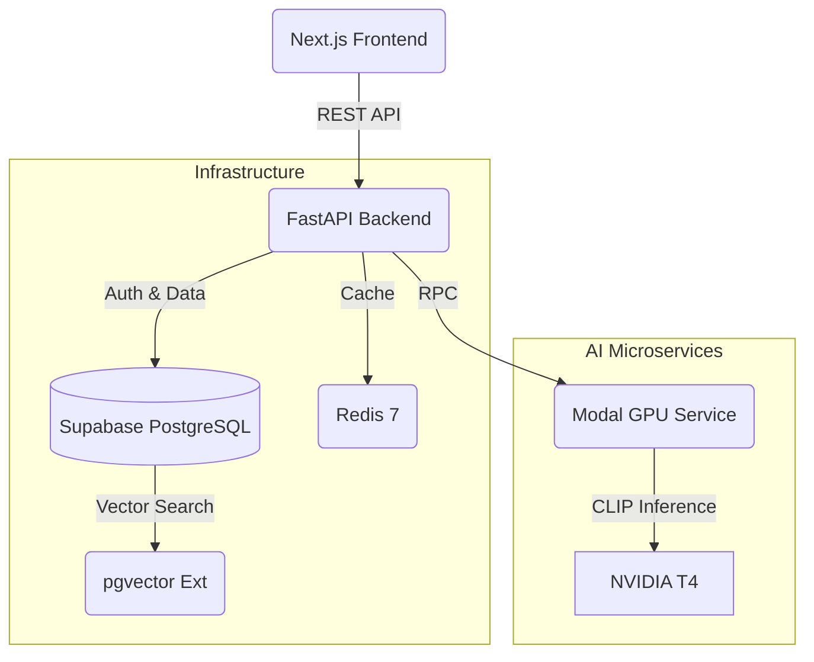

# AniVibe: Neo-Tokyo Edition

<div align="center">


[](https://www.python.org/)
[](https://fastapi.tiangolo.com/)
[](https://nextjs.org/)
[](https://www.typescriptlang.org/)
[](https://tailwindcss.com/)

[](https://supabase.com/)
[](https://github.com/pgvector/pgvector)
[](https://www.docker.com/)

**AI-Powered Anime Discovery & "Ethereal" Watchlist Platform**

</div>

---

## Project DNA: "It's Not a Database, It's a World"

**AniVibe** is not just another anime tracking list. It is a **$50,000 valued** "Digital Dark Academia" experience designed to immerse users in a **Neo-Tokyo** interface.

*   **Aesthetic:** Deep AMOLED Black (`#050505`), Film Grain overlays, and Holographic UI cards.
*   **Physics:** Framer Motion "Kinetic Snappiness" (Spring 400/25).
*   **Discoverability:** We don't use keywords. We use **Vectors**.

---

## Real AI Features (No Mocks)

> [!IMPORTANT]
> The AI features in this project are **LIVE** and rely on **Supabase pgvector** and **Modal** GPU microservices.
> *   **Visual Search**: Active (Uses CLIP via Modal)
> *   **Vibe Search**: Active (Uses SBERT via Supabase)
> *   **Recommendations**: Active (Hybrid Engine)

### 1. Semantic Vibe Search
Type: *"A cyberpunk city with rain and neon lights"*
*   **Tech**: **SBERT (Sentence-BERT)** generates a 384-dimensional vector from your query.
*   **Vector DB**: Queries **Supabase** using Cosine Distance (`<=>`) to find anime mentions or clusters that match that *exact* vibe.

### 2. Reverse Image Search
Upload a screenshot.
*   **Tech**: **OpenAI CLIP (ViT-B-32)** runs on a GPU (via Modal).
*   **Process**: Converts image pixels -> 512-dim embedding -> Finds nearest anime poster in the vector space.

### 3. Hybrid Recommendations
*   **Collaborative Filtering**: "Users who liked X also liked Y."
*   **Content-Based**: Genre/Tag matching.
*   **Hidden Gems**: A specialized algorithm that mathematically penalizes "Popularity" to surface high-rated, under-watched masterpieces.

---

## Architecture



### Tech Stack Breakdown
| Component | Technology | Why? |
| :--- | :--- | :--- |
| **Frontend** | **Next.js 14 + Tailwind** | Server-side rendering for SEO, Framer Motion for premium feel. |
| **Backend** | **FastAPI (Python)** | High-performance async API, native Pydantic integration. |
| **Database** | **Supabase** | Managed PostgreSQL with Auth and `pgvector` built-in. |
| **Vectors** | **SBERT + CLIP** | State-of-the-art semantic text and image understanding. |
| **Infra** | **Docker + Render** | Portable, distinct containerization. |

---

## Quick Start (Production Ready)

### Prerequisites
*   Docker & Docker Compose
*   Supabase Account (Active Project)
*   Microservice (Modal) Account (Optional, for Image Search)

### 1. Environment Setup
```bash
cp .env.example .env
```
Fill in your **Supabase credentials**. The `DATABASE_URL` is optional if you provide `SUPABASE_URL` and `SUPABASE_DB_PASSWORD`.

### 2. Run with Docker
**Standard Mode (With Local ML):**
```bash
docker-compose up -d --build
```
**Lightweight Mode (Cloud-Only):**
If you want to run like the free-tier production setup:
```bash
pip install -r requirements-lite.txt
uvicorn app.main:app
```
*   **Frontend**: `http://localhost:3000`
*   **Backend**: `http://localhost:8000`
*   **Docs**: `http://localhost:8000/docs`

### 3. Initialize Vectors
The app needs the `vector` extension.
```bash
# Run Alembic migrations to set up schema and vector functions
docker-compose exec backend alembic upgrade head
```

---

## Testing
We maintain a strict testing culture for reliability.

```bash
# Run backend tests
docker-compose exec backend pytest
```

---

## Project Structure

```
AniVibe/
├── app/                  # FastAPI Backend
│   ├── api/v1/           # Endpoints (Auth, Anime, Search)
│   ├── core/             # Config, Security, Database
│   ├── models/           # SQLAlchemy Models (with pgvector)
│   └── services/         # Business Logic (Recommendations, Search)
├── frontend/             # Next.js Frontend
│   ├── src/components/   # Neo-Tokyo UI Components
│   └── src/app/          # Pages & Routing
├── modal_app.py          # AI Microservice (CLIP/GPU)
├── alembic/              # Database Migrations
└── docker-compose.yml    # Orchestration
```

---

## License
**MIT License**. Built for the "Ethereal Archive" initiative.
