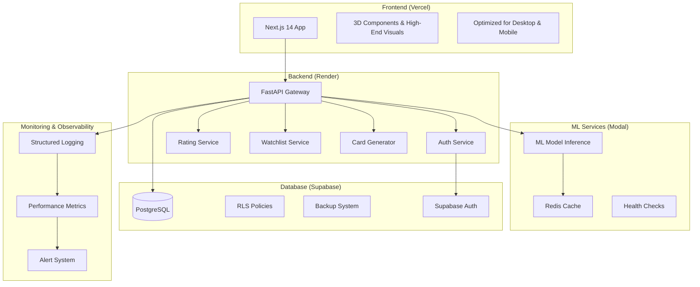

# Requirements Document

## Introduction

This document specifies the requirements for a comprehensive production audit and hardening of the AniVibe project. AniVibe is a $50k high-value project requiring zero tolerance for security vulnerabilities and performance issues. The system provides anime rating, watchlist management, GitHub heatmap-style activity tracking, and beautiful social media card sharing features with polished visuals and 3D elements optimized for both desktop and mobile. The production architecture consists of:
- **Frontend**: Deployed on Vercel with high-end visuals and 3D graphics
- **Backend**: FastAPI services hosted on Render
- **ML Models**: Hosted on Modal for scalable inference
- **Database**: Supabase for PostgreSQL database storage only

## Glossary

- **AniVibe_System**: The complete application stack with frontend on Vercel, backend on Render, ML models on Modal, and Supabase for database storage
- **Rating_Service**: Anime rating and review management system running on Render
- **Watchlist_Service**: User watchlist and activity tracking with heatmap visualization running on Render
- **Card_Generator**: Social media card creation and sharing service with 3D visual elements running on Render
- **Auth_Service**: Authentication and authorization components running on Render with Supabase Auth
- **API_Gateway**: Backend API endpoints and routing layer hosted on Render
- **Database_Layer**: Supabase PostgreSQL database with RLS policies and constraints
- **ML_Service**: Machine learning model inference service hosted on Modal for recommendations and content analysis
- **Frontend_App**: Client-side Next.js application deployed on Vercel with high-end visuals and 3D elements
- **Security_Scanner**: Automated security vulnerability detection system
- **Performance_Monitor**: System performance tracking and alerting service

## Requirements

### Requirement 1: Security Hardening

**User Story:** As a security administrator, I want all authentication vulnerabilities eliminated, so that user data and system integrity are protected against attacks.

#### Acceptance Criteria

1. WHEN JWT tokens are issued, THE Auth_Service SHALL store them in HttpOnly cookies with Secure and SameSite attributes
2. WHEN a user authenticates, THE Auth_Service SHALL validate passwords against OWASP complexity requirements (minimum 12 characters, mixed case, numbers, special characters)
3. WHEN authentication requests exceed 5 attempts per minute per IP, THE API_Gateway SHALL implement rate limiting and return HTTP 429
4. WHEN CORS requests are made, THE API_Gateway SHALL only allow explicitly whitelisted origins and reject wildcard configurations
5. WHEN Supabase RLS policies are evaluated, THE Database_Layer SHALL enforce row-level security for all user data access
6. WHEN security scans are performed, THE Security_Scanner SHALL detect zero critical or high-severity vulnerabilities

### Requirement 2: API Integration Integrity

**User Story:** As a frontend developer, I want all API endpoints to match frontend expectations exactly, so that data flows correctly without integration failures.

#### Acceptance Criteria

1. WHEN frontend requests are made to backend endpoints, THE API_Gateway SHALL validate all request schemas against OpenAPI specifications
2. WHEN backend responses are returned, THE API_Gateway SHALL validate all response schemas match documented contracts
3. WHEN API errors occur, THE API_Gateway SHALL return standardized error responses with consistent structure and error codes
4. WHEN missing endpoints are identified, THE API_Gateway SHALL implement all endpoints required by frontend components
5. WHEN API documentation is generated, THE API_Gateway SHALL automatically sync with actual endpoint implementations

### Requirement 3: Database Integrity and Security

**User Story:** As a database administrator, I want robust data integrity constraints and security policies, so that data corruption and unauthorized access are prevented.

#### Acceptance Criteria

1. WHEN data is inserted or updated, THE Database_Layer SHALL enforce foreign key constraints, check constraints, and data type validations
2. WHEN users access data, THE Database_Layer SHALL apply RLS policies that restrict access to user-owned or authorized records only
3. WHEN database backups are created, THE Database_Layer SHALL perform automated daily backups with point-in-time recovery capability
4. WHEN database connections are established, THE Database_Layer SHALL use connection pooling with maximum 20 concurrent connections per service
5. WHEN sensitive data is stored, THE Database_Layer SHALL encrypt personally identifiable information at rest

### Requirement 4: ML Model Performance Optimization

**User Story:** As a system architect, I want ML model inference to be fast and reliable, so that users experience responsive AI features without service interruptions.

#### Acceptance Criteria

1. WHEN ML model predictions are requested, THE ML_Service SHALL return cached results for identical inputs within 50ms
2. WHEN primary ML models fail, THE ML_Service SHALL automatically fallback to backup models within 2 seconds
3. WHEN GPU memory usage exceeds 80%, THE ML_Service SHALL implement memory cleanup and optimization routines
4. WHEN ML model health checks run, THE ML_Service SHALL verify model availability and accuracy every 60 seconds
5. WHEN Redis cache is used, THE ML_Service SHALL store model predictions with TTL of 1 hour and LRU eviction policy

### Requirement 5: Frontend Performance Optimization

**User Story:** As an end user, I want the application to load quickly with stunning visuals and smooth 3D animations, so that I can enjoy a premium AniVibe experience without any performance compromises.

#### Acceptance Criteria

1. WHEN the application loads on Vercel, THE Frontend_App SHALL achieve First Contentful Paint under 1.2 seconds on 3G connections
2. WHEN JavaScript bundles are built, THE Frontend_App SHALL implement code splitting with chunks under 200KB each for optimal loading
3. WHEN 3D elements and animations are rendered, THE Frontend_App SHALL maintain 60fps performance on both desktop and mobile devices
4. WHEN images and visual assets are displayed, THE Frontend_App SHALL serve optimized WebP/AVIF formats with progressive loading
5. WHEN performance monitoring runs, THE Performance_Monitor SHALL track Core Web Vitals and ensure no visual or interaction regressions

### Requirement 6: Production Monitoring and Observability

**User Story:** As a DevOps engineer, I want comprehensive monitoring and alerting, so that I can detect and resolve issues before they impact users.

#### Acceptance Criteria

1. WHEN system errors occur, THE Performance_Monitor SHALL send alerts within 30 seconds via multiple channels (email, Slack, PagerDuty)
2. WHEN logs are generated, THE AniVibe_System SHALL output structured JSON logs with correlation IDs and severity levels
3. WHEN health checks are performed, THE AniVibe_System SHALL expose /health endpoints returning detailed service status within 200ms
4. WHEN metrics are collected, THE Performance_Monitor SHALL track response times, error rates, and resource utilization with 1-minute granularity
5. WHEN operational procedures are needed, THE AniVibe_System SHALL provide essential runbooks for critical production scenarios only

### Requirement 7: Data Validation and Error Handling

**User Story:** As a quality assurance engineer, I want robust input validation and error handling, so that invalid data cannot corrupt the system or cause crashes.

#### Acceptance Criteria

1. WHEN user input is received, THE API_Gateway SHALL validate all inputs against strict schemas and reject malformed requests
2. WHEN validation errors occur, THE API_Gateway SHALL return detailed error messages with field-specific validation failures
3. WHEN system exceptions are thrown, THE AniVibe_System SHALL log full stack traces while returning sanitized error messages to clients
4. WHEN data serialization occurs, THE AniVibe_System SHALL validate data integrity during JSON encoding and decoding operations
5. WHEN file uploads are processed, THE API_Gateway SHALL validate file types, sizes, and scan for malicious content

### Requirement 8: Deployment and Infrastructure Security

**User Story:** As a security engineer, I want secure deployment practices and infrastructure hardening, so that the production environment is protected against attacks.

#### Acceptance Criteria

1. WHEN services are deployed, THE AniVibe_System SHALL use HTTPS/TLS 1.3 for all external communications
2. WHEN environment variables are managed, THE AniVibe_System SHALL store secrets in encrypted vaults with rotation policies
3. WHEN network traffic flows, THE AniVibe_System SHALL implement network segmentation and firewall rules restricting unnecessary access
4. WHEN container images are built, THE AniVibe_System SHALL scan for vulnerabilities and use minimal base images
5. WHEN access logs are generated, THE AniVibe_System SHALL record all administrative actions with user attribution and timestamps

### Requirement 9: Core Feature Performance and Reliability

**User Story:** As an anime enthusiast, I want rating, watchlist, and social sharing features to work reliably with beautiful visuals and 3D elements, so that I can track and share my anime experience with a premium, polished interface.

#### Acceptance Criteria

1. WHEN anime ratings are submitted, THE Rating_Service SHALL persist ratings within 300ms and update aggregate scores with smooth visual transitions
2. WHEN watchlist items are added or removed, THE Watchlist_Service SHALL update the user's 3D heatmap visualization within 800ms with fluid animations
3. WHEN social media cards are generated, THE Card_Generator SHALL create high-quality visual cards with 3D elements within 1.5 seconds
4. WHEN activity heatmaps are displayed, THE Watchlist_Service SHALL render GitHub-style 3D visualizations with smooth 60fps animations and interactive hover effects
5. WHEN sharing features are used, THE Card_Generator SHALL generate polished cards with proper Open Graph tags and optimized visual quality for all social platforms


# Design Document: Production Audit

## Overview

This design document outlines the comprehensive production audit and hardening strategy for AniVibe, a $50k high-value anime tracking application. The production architecture spans multiple platforms:
- **Vercel**: Frontend deployment with high-end visuals and 3D graphics optimized for desktop and mobile
- **Render**: Backend FastAPI services for all API endpoints and business logic  
- **Modal**: ML model hosting for scalable inference and recommendations
- **Supabase**: PostgreSQL database storage with authentication and RLS policies

The audit addresses critical security vulnerabilities, API integration issues, database integrity concerns, ML model optimization, and frontend performance while maintaining premium visual experience with 3D elements and zero tolerance for unfinished features.

## Architecture

### System Architecture Overview



### Security Architecture

The security model implements defense-in-depth with multiple layers:

1. **Transport Security**: TLS 1.3 for all communications
2. **Authentication**: JWT tokens in HttpOnly cookies with CSRF protection
3. **Authorization**: Supabase RLS policies for data access control
4. **Input Validation**: Schema-based validation at API gateway
5. **Rate Limiting**: Per-endpoint and per-IP rate limiting
6. **Network Security**: Firewall rules and network segmentation

## Components and Interfaces

### Authentication Service

**Purpose**: Secure user authentication with JWT in HttpOnly cookies

**Key Components**:
- JWT token storage in HttpOnly cookies
- OWASP-compliant password validation
- Rate limiting for auth endpoints

**Interface**:
```typescript
interface AuthService {
  authenticate(email: string, password: string): Promise<AuthResult>
  validateToken(token: string): Promise<boolean>
  logout(sessionId: string): Promise<void>
}
```

### API Gateway

**Purpose**: Request validation, routing, and standardized error handling

**Key Components**:
- OpenAPI schema validation
- CORS configuration
- Standardized error responses

**Interface**:
```typescript
interface APIGateway {
  validateRequest(request: APIRequest): boolean
  handleError(error: Error): ErrorResponse
}
```

### Database Layer

**Purpose**: Secure data persistence with RLS policies and constraints

**Key Components**:
- Supabase RLS policies for user data access
- Database constraints and validation
- Connection pooling (max 20 per service)

**RLS Policy Example**:
```sql
CREATE POLICY user_data_policy ON ratings
  FOR ALL USING (auth.uid() = user_id);
```

### ML Service

**Purpose**: Fast ML inference with Redis caching and fallback

**Key Components**:
- Redis caching for identical inputs (1-hour TTL)
- Fallback to backup models on failure
- GPU memory management

**Interface**:
```typescript
interface MLService {
  predict(input: MLInput): Promise<MLPrediction>
  healthCheck(): Promise<boolean>
}
```

### Frontend Performance Layer

**Purpose**: Optimized loading and 3D rendering performance

**Key Components**:
- Code splitting (chunks < 200KB)
- WebP/AVIF image optimization
- 3D rendering with 60fps target

**Performance Targets**:
- First Contentful Paint: < 1.2s on 3G
- Smooth 60fps 3D animations

## Data Models

### User Data Model

```typescript
interface User {
  id: string
  email: string
  username: string
  createdAt: Date
  lastLoginAt: Date
  preferences: UserPreferences
}

interface UserPreferences {
  theme: 'light' | 'dark' | 'auto'
  language: string
  notifications: NotificationSettings
  privacy: PrivacySettings
}
```

### Rating Data Model

```typescript
interface Rating {
  id: string
  userId: string
  animeId: string
  score: number // 1-10
  review?: string
  createdAt: Date
  updatedAt: Date
}

interface AnimeRatingAggregate {
  animeId: string
  averageScore: number
  totalRatings: number
  distribution: Record<number, number>
}
```

### Watchlist Data Model

```typescript
interface WatchlistItem {
  id: string
  userId: string
  animeId: string
  status: 'watching' | 'completed' | 'planned' | 'dropped' | 'paused'
  progress: number
  startDate?: Date
  completedDate?: Date
  createdAt: Date
  updatedAt: Date
}

interface ActivityHeatmap {
  userId: string
  year: number
  data: Record<string, number> // date -> activity count
  totalActivity: number
}
```

### Social Card Data Model

```typescript
interface SocialCard {
  id: string
  userId: string
  type: 'rating' | 'watchlist' | 'achievement'
  content: CardContent
  imageUrl: string
  metadata: OpenGraphMetadata
  createdAt: Date
}

interface CardContent {
  title: string
  subtitle?: string
  stats: Record<string, any>
  visualElements: VisualElement[]
}
```

## Correctness Properties

*A property is a characteristic or behavior that should hold true across all valid executions of a system—essentially, a formal statement about what the system should do. Properties serve as the bridge between human-readable specifications and machine-verifiable correctness guarantees.*

Before defining the correctness properties, I need to analyze the acceptance criteria to determine which ones are testable as properties, examples, or edge cases.

### Security Properties

**Property 1: JWT Token Security**
*For any* JWT token issued by the Auth_Service, the token should be stored in an HttpOnly cookie with Secure and SameSite attributes properly configured
**Validates: Requirements 1.1**

**Property 2: Password Validation Compliance**
*For any* password submitted for authentication, the Auth_Service should validate it against OWASP complexity requirements (minimum 12 characters, mixed case, numbers, special characters)
**Validates: Requirements 1.2**

**Property 3: Rate Limiting Enforcement**
*For any* IP address making authentication requests, when the request count exceeds 5 per minute, the API_Gateway should return HTTP 429 status
**Validates: Requirements 1.3**

**Property 4: CORS Origin Validation**
*For any* CORS request, the API_Gateway should only allow explicitly whitelisted origins and reject any wildcard configurations
**Validates: Requirements 1.4**

**Property 5: Row-Level Security Enforcement**
*For any* database query involving user data, the Database_Layer should enforce RLS policies ensuring users can only access their own or authorized records
**Validates: Requirements 1.5, 3.2**

### API Integration Properties

**Property 6: Request Schema Validation**
*For any* API request received, the API_Gateway should validate the request payload against OpenAPI specifications and reject malformed requests
**Validates: Requirements 2.1, 7.1**

**Property 7: Response Schema Validation**
*For any* API response returned, the API_Gateway should validate the response payload matches documented contracts
**Validates: Requirements 2.2**

**Property 8: Standardized Error Responses**
*For any* error condition, the API_Gateway should return standardized error responses with consistent structure, error codes, and field-specific validation details
**Validates: Requirements 2.3, 7.2**

### Database Integrity Properties

**Property 9: Database Constraint Enforcement**
*For any* data insertion or update operation, the Database_Layer should enforce foreign key constraints, check constraints, and data type validations
**Validates: Requirements 3.1**

**Property 10: Connection Pool Management**
*For any* database connection request, the Database_Layer should use connection pooling with a maximum of 20 concurrent connections per service
**Validates: Requirements 3.4**

**Property 11: Data Encryption at Rest**
*For any* personally identifiable information stored, the Database_Layer should encrypt the data at rest
**Validates: Requirements 3.5**

### ML Service Properties

**Property 12: ML Prediction Caching**
*For any* ML prediction request with identical inputs, the ML_Service should return cached results within 50ms when available
**Validates: Requirements 4.1**

**Property 13: ML Model Fallback**
*For any* primary ML model failure, the ML_Service should automatically fallback to backup models within 2 seconds
**Validates: Requirements 4.2**

**Property 14: GPU Memory Management**
*For any* GPU memory usage exceeding 80%, the ML_Service should implement memory cleanup and optimization routines
**Validates: Requirements 4.3**

**Property 15: Redis Cache Configuration**
*For any* ML prediction cached in Redis, the ML_Service should store it with TTL of 1 hour and LRU eviction policy
**Validates: Requirements 4.5**

### Frontend Performance Properties

**Property 16: Bundle Size Optimization**
*For any* JavaScript bundle built, the Frontend_App should implement code splitting with individual chunks under 200KB each
**Validates: Requirements 5.2**

**Property 17: Image Format Optimization**
*For any* image or visual asset displayed, the Frontend_App should serve optimized WebP/AVIF formats with progressive loading
**Validates: Requirements 5.4**

### Monitoring and Observability Properties

**Property 18: Alert Response Time**
*For any* system error that occurs, the Performance_Monitor should send alerts within 30 seconds via multiple channels
**Validates: Requirements 6.1**

**Property 19: Structured Logging Format**
*For any* log entry generated, the AniVibe_System should output structured JSON logs with correlation IDs and severity levels
**Validates: Requirements 6.2**

**Property 20: Health Endpoint Performance**
*For any* health check request, the AniVibe_System should return detailed service status within 200ms
**Validates: Requirements 6.3**

### Data Validation Properties

**Property 21: Exception Handling**
*For any* system exception thrown, the AniVibe_System should log full stack traces while returning sanitized error messages to clients
**Validates: Requirements 7.3**

**Property 22: Serialization Round Trip**
*For any* valid system object, serializing then deserializing should produce an equivalent object with data integrity preserved
**Validates: Requirements 7.4**

**Property 23: File Upload Validation**
*For any* file upload processed, the API_Gateway should validate file types, sizes, and scan for malicious content
**Validates: Requirements 7.5**

**Property 24: Administrative Action Logging**
*For any* administrative action performed, the AniVibe_System should record the action with user attribution and timestamps
**Validates: Requirements 8.5**

### Core Feature Properties

**Property 25: Rating Persistence Performance**
*For any* anime rating submitted, the Rating_Service should persist the rating within 300ms and update aggregate scores
**Validates: Requirements 9.1**

**Property 26: Watchlist Update Performance**
*For any* watchlist item added or removed, the Watchlist_Service should update the user's heatmap visualization within 800ms
**Validates: Requirements 9.2**

**Property 27: Social Card Generation Performance**
*For any* social media card generation request, the Card_Generator should create high-quality visual cards within 1.5 seconds
**Validates: Requirements 9.3**

**Property 28: Heatmap Rendering Performance**
*For any* activity heatmap display request, the Watchlist_Service should render 3D visualizations with smooth animations and interactive effects
**Validates: Requirements 9.4**

**Property 29: Social Card Sharing Quality**
*For any* sharing operation, the Card_Generator should generate cards with proper Open Graph tags and optimized visual quality for all social platforms
**Validates: Requirements 9.5**

## Error Handling

### Error Response Format

Standardized error format for consistency:

```typescript
interface ErrorResponse {
  error: {
    code: string
    message: string
    timestamp: string
    correlationId: string
  }
}
```

### Error Recovery Strategies

**ML Service Fallback**: Simple fallback to backup models when primary fails
**Database Retries**: Basic retry logic with exponential backoff
**User-Friendly Messages**: Log technical details, show simple messages to users

## Testing Strategy

### Dual Testing Approach

**Unit Tests**: Specific examples, edge cases, integration points
**Property Tests**: Universal properties across randomized inputs (minimum 100 iterations each)

### Testing Framework Selection

**Frontend**: fast-check for TypeScript property testing
**Backend**: Choose appropriate property testing library for the implementation language
**Database**: Basic constraint and RLS policy testing

### Key Testing Areas

**Security**: Authentication, authorization, input validation, CORS
**Performance**: API response times, ML model caching, frontend loading
**Data Integrity**: Database constraints, serialization, file uploads
**Core Features**: Rating persistence, watchlist updates, card generation

### Property Test Format

Each property test references its design property:
```typescript
// Feature: production-audit, Property 1: JWT Token Security
test('JWT tokens have secure attributes', () => {
  // Property test implementation
});
```USE 